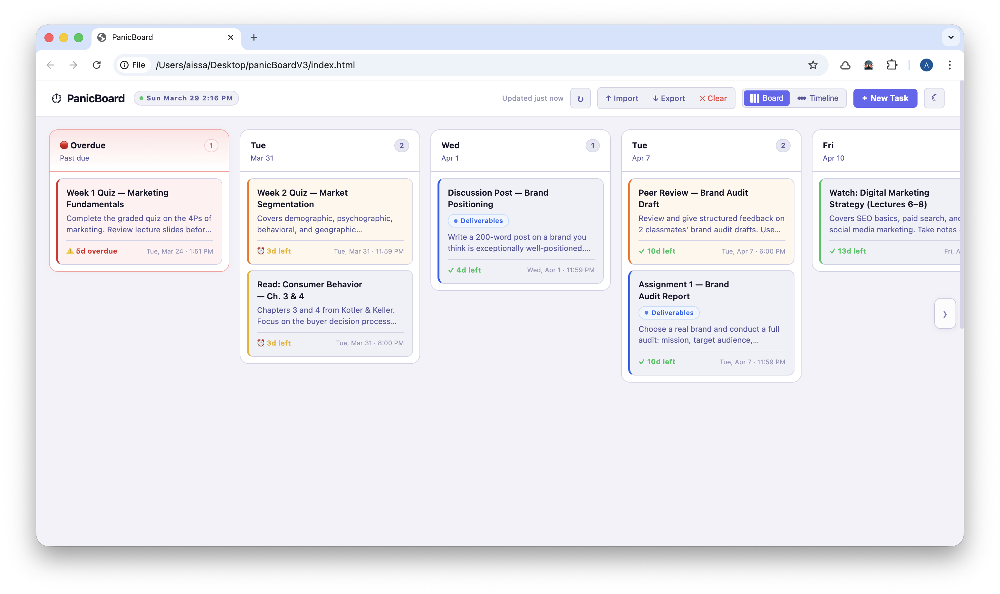
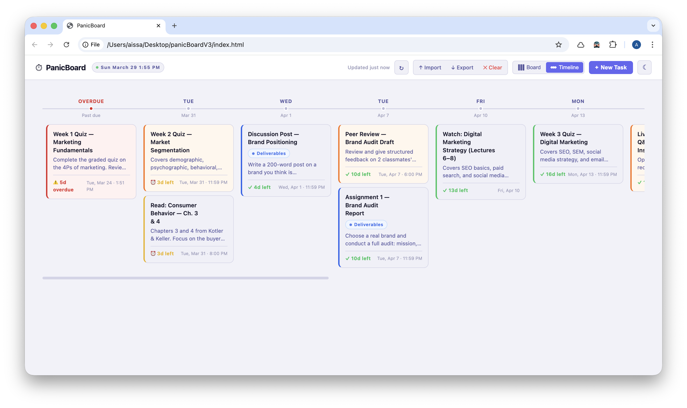
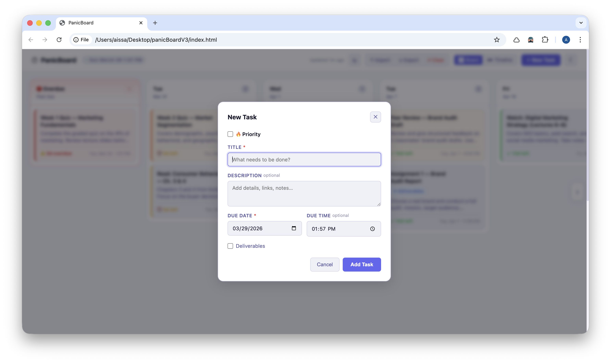

# PanicBoard

A lightweight, deadline-focused Kanban board for tracking tasks with urgency. Built with vanilla HTML, CSS, and JavaScript — no frameworks, no build tools.





## Features

- **Kanban & Timeline views** — switch between a columnar board grouped by date and a horizontal timeline
- **Task management** — create, edit, and delete tasks with title, description, due date/time, and tag
- **Priority sorting** — mark tasks as 🔥 Priority to pin them to the top of their column, above time-sorted tasks
- **Read-only preview** — click any card to open a quick preview before deciding to edit or delete
- **Drag and drop** — move cards between date columns (future columns only)
- **Import / Export** — back up and restore tasks as JSON files
- **Clear all data** — reset the board with a confirmation prompt
- **Undo** — step back through the last 20 state changes with `Cmd+Z` / `Ctrl+Z`
- **Countdown timers** — live countdowns on each card (days, hours, minutes)
- **Stale indicator** — shows how long since the board was last refreshed
- **Notes panel** — persistent scratchpad for quick ideas, auto-saves as you type
- **Light / Dark theme** — persisted across sessions
- **Toast notifications** — non-blocking feedback for actions

## Getting Started

No install or build step required. Just open `index.html` in a browser.

```bash
open index.html
```

Or serve it locally:

```bash
npx serve .
# then visit http://localhost:3000
```

## Keyboard Shortcuts

| Shortcut | Action |
|---|---|
| `N` | New task |
| `Cmd+Z` / `Ctrl+Z` | Undo last action |
| `Esc` | Close any open modal |

## Data

All data is stored in `localStorage`. Nothing is sent to a server.

| Key | Contents |
|---|---|
| `panicboard_v1` | Tasks array |
| `panicboard_note` | Notes scratchpad content |
| `panicboard_theme` | Light / dark preference |

Use **Export** to save a JSON backup and **Import** to restore it on any device.

## Project Structure

```
index.html   — markup and modal templates
script.js    — all application logic
style.css    — styling with CSS custom properties (light + dark themes)
```
